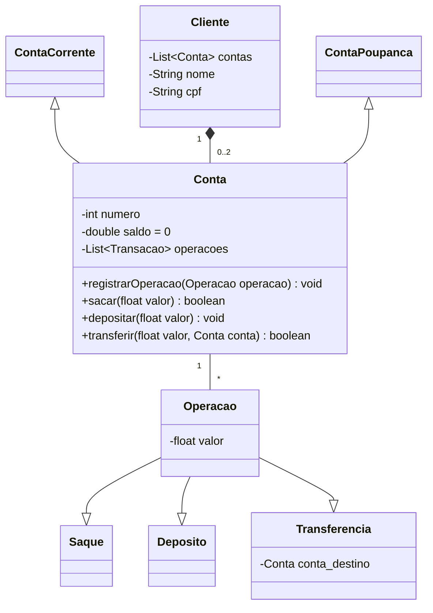

# Sistema Bancário com Java

Este pequeno projeto simula um sistema de transações bancárias como saques, depósitos e visualização de extratos.

## Tecnologias

* Java 21
* Mermaid (Diagrama UML)

## Diagrama de Classes

## Contato

* Luan T. Felix - [lutavares.bros@gmail.com](mailto:lutavares.bros@gmail.com)
* [LinkedIn](https://www.linkedin.com/in/luan-tavares-felix-24273a289/)